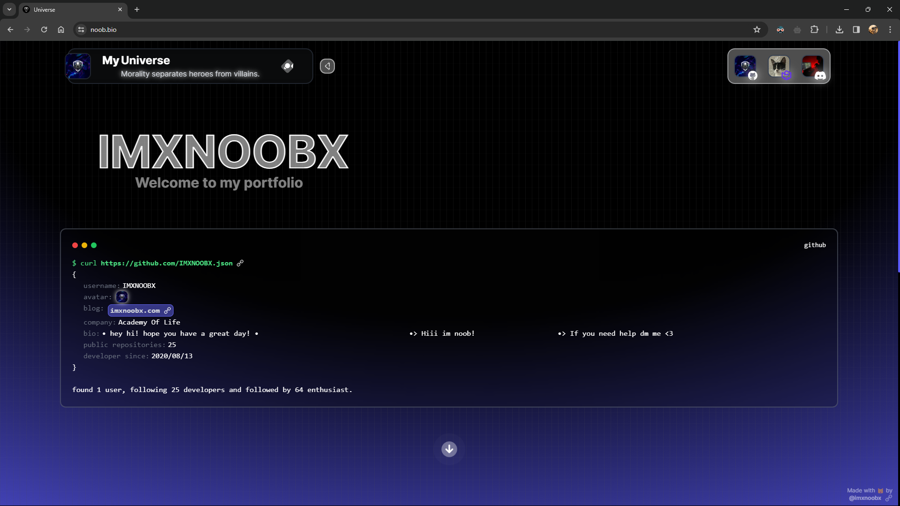

# 🔮 Universe

**Universe** (v2) *is my personal portfolio*. It showcases my github projects and updates automatically using *Next.js* server componets from version *14.1.x* and above. It is a simple and clean portfolio that is easy to customize and deploy. It is also responsive and works on all devices. It is built with *React*, *Next.js*, and *Tailwind CSS*.



> My old portfolio can be found in  **The [Old Branch](https://github.com/IMXNOOBX/my-universe/tree/old-2023)** which is built with vanilla react and tailwind css. And will automatically sync with your github username.

## 🌳 Simple Use

* Please keep the credits if you are using this project

1. Clone the repository or instead download it to your local computer by downloading the zip file.
2. Go to your `.env.template` file and rename it to `.env` with your github username.
3. To work on locally use `npm run dev` and if you want to deploy the site to production run `npm run production` this will build & host the website in the port 4224.

* You can also deploy the site to vercel or netlify by connecting your github repository to the respective platform.

> **Note:** This project uses enviromental files to store public data and settings. Learn more at [Next.js Env Variables](https://nextjs.org/docs/app/building-your-application/configuring/environment-variables).


## 💫 Credits

* [*React*](https://reactjs.org/): A JavaScript library for building user interfaces
* [*Next.js*](https://nextjs.org/): The React Framework
* [*Tailwind CSS*](https://tailwindcss.com/): A utility-first CSS framework for rapidly building custom designs
* All the [libraries](./package.json) used in the project
* [*Icons8*](https://icons8.com/icons) for the icons!

# 🔖 License & Copyright

This project is licensed under [**CC BY-NC 4.0**](https://creativecommons.org/licenses/by-nc/4.0/).
```diff
+ You are free to:
	• Share: Copy and redistribute the material in any medium or format.
	• Adapt: Remix, transform, and build upon the material.
+ Under the following terms:
	• Attribution: You must give appropriate credit, provide a link to original the source repository, and indicate if changes were made.
	• Non-Commercial: You may not use the material for commercial purposes.
- You are not allowed to:
	• Sell: This license forbids selling original or modified material for commercial purposes.
	• Sublicense: This license forbids sublicensing original or modified material.
```
### ©️ Copyright
The content of this project is ©️ by [IMXNOOBX](https://github.com/IMXNOOBX) and the respective contributors. See the [LICENSE.md](LICENSE.md) file for details.